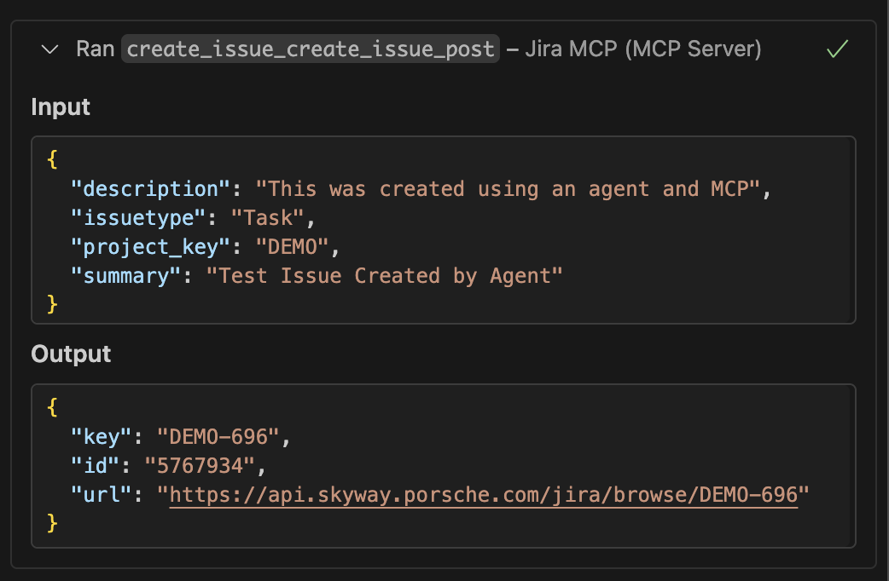
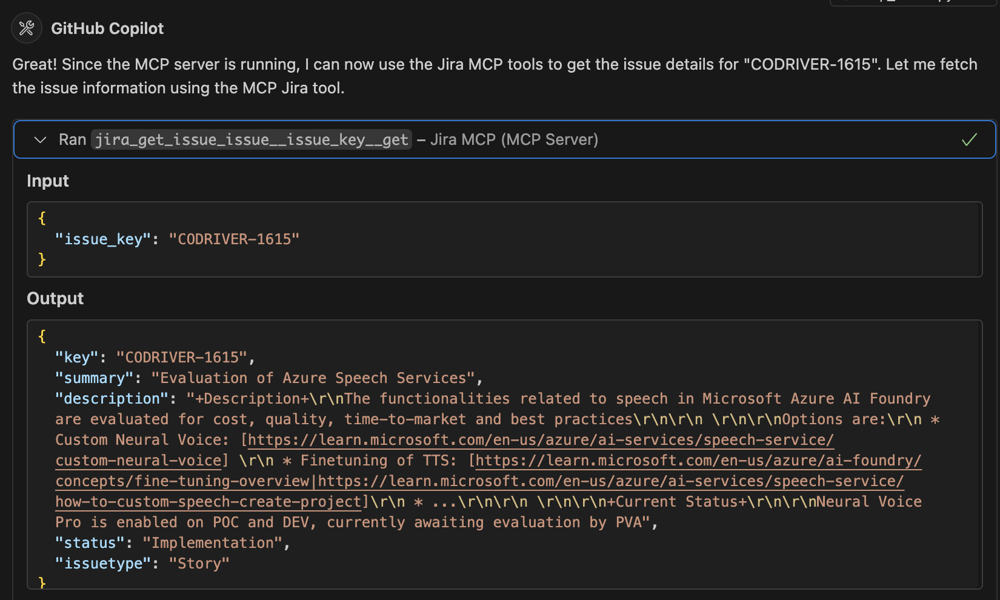

# Jira MCP Server

Easily connect to Jira via MCP using a Private Access Token (PAT).

<div align="center">

<table>
    <tr>
        <td width="50%" align="center">
            
            <br>
            <em>Agent Creating Issue</em>
        </td>
        <td width="50%" align="center">
            
            <br>
            <em>Agent Fetching Issue</em>
        </td>
    </tr>
</table>

</div>

## Getting Started

1. [Create a PAT](https://skyway.porsche.com/jira/plugins/servlet/desk/portal/1) using the Service Desk
2. Copy your PAT to a `.env` file (see `.env.example` for guidance).
3. Configure additional settings if needed:
    - Set `JIRA_BASE_URL` if using a different Jira instance (default: https://cicd.skyway.porsche.com)
    - Set proxy variables (`HTTP_PROXY`, `HTTPS_PROXY`) if behind a corporate firewall
    - Set `MCP_PORT` to configure the server port (default is 8000)
    - Set `MCP_TRANSPORT` to `http` (default) or `stdio` to select the MCP transport protocol

### Option 1: Docker

Run the Jira MCP server using Docker:

```
# From the jira-mcp directory
docker-compose up -d

# Or from the parent mcporsche directory to run all MCP servers
cd ..
docker-compose up -d jira-mcp
```

The server will be available at:
```
http://localhost:8000/mcp/
```

To stop the server:
```bash
docker-compose down
```

### Option 2: Local Installation

Start the server:
```
# Linux/Mac
./start-mcp.sh

# Windows
start-mcp.bat
```

Configure your MCP Client to use the server URL:
```
http://localhost:<MCP_PORT>/mcp/
```
i.e.
```
http://localhost:8000/mcp/
```

## Testing

Test scripts are provided to validate the server is running correctly and all endpoints are accessible.

### PowerShell (Windows)
```powershell
.\test_mcp_client.ps1
```

### Bash (Linux/Mac/WSL)
```bash
bash test_mcp_client.sh
```

Both scripts test:
1. Search Issues (Recent)
2. Get Issue Details
3. Search Issues by Project
4. Complex JQL Queries
5. Get Issue Attachments

The scripts will display SUCCESS/FAILED status for each test and provide sample output. Install `jq` (for bash) for better formatted JSON output.

### API Documentation
Once the server is running, you can access:
- Interactive API docs: `http://localhost:8000/docs`
- OpenAPI schema: `http://localhost:8000/openapi.json`

## Prompts & Best Practices

The `prompts/` directory contains comprehensive guides for using the Jira MCP Server effectively with AI assistants like GitHub Copilot:

### 📄 [prompts/README.md](prompts/README.md)
Overview of all prompt files and quick start examples.

### 📘 [prompts/context.md](prompts/context.md)
Complete context about the Jira MCP Server including:
- Available operations and endpoints
- Authentication details
- Common Jira projects at Porsche
- JQL query syntax
- Issue types and statuses
- Response formats

### 💡 [prompts/sample-prompts.md](prompts/sample-prompts.md)
Curated collection of ready-to-use prompt examples:
- Quick start prompts
- Project management scenarios
- Bug management workflows
- Development workflow prompts
- Reporting and analytics
- Advanced query examples
- Attachment management
- Bulk operations

### ⚡ [prompts/best-practices.md](prompts/best-practices.md)
Comprehensive best practices for:
- Query optimization
- Issue creation and updates
- Search patterns
- Performance optimization
- Security considerations
- Error handling
- Team collaboration
- Common pitfalls to avoid

### 🤖 [prompts/copilot-commands.md](prompts/copilot-commands.md)
GitHub Copilot-specific commands and patterns:
- @jira mention commands
- Conversational patterns
- Context-aware commands
- Batch operations
- Workflow helpers
- Natural language variations
- Role-specific patterns

## Available Operations

### Get Issue Details
Retrieve comprehensive information about a JIRA issue including assignee, reporter, dates, project info, priority, resolution, components, time tracking, comments, and available transitions.

**Endpoint:** `GET /issue/{issue_key}`

### Create Issue
Create a new JIRA issue in a specified project with optional epic linking.

**Endpoint:** `POST /create_issue`
- `project_key`: Project key (e.g., "ITDMFC")
- `summary`: Issue summary/title
- `description`: Issue description
- `issuetype`: Type of issue (default: "Task")
- `epic_link`: *(Optional)* Epic key to link this issue to (e.g., "SLIM-123")
- `versions`: *(Optional)* List of affectsVersion names (e.g., ["PI-26.1"])
- `fix_versions`: *(Optional)* List of fixVersion names (e.g., ["PI-26.1"])

**Example with Epic Link:**
```bash
curl -X POST "http://localhost:8000/create_issue" \
  -H "Content-Type: application/json" \
  -d '{
    "project_key": "SLIM",
    "summary": "New feature implementation",
    "description": "Implement the new dashboard feature",
    "issuetype": "Story",
    "epic_link": "SLIM-78"
  }'
```

### Update Issue
Update an existing JIRA issue. Provide only the fields you want to update.

**Endpoint:** `PUT /issue/{issue_key}`

**Supported updates:**
- `summary`: Update issue title
- `description`: Update issue description
- `assignee`: Change assignee (use "Unassigned" to unassign)
- `status`: Change status (must match available transitions)
- `priority`: Change priority (e.g., "High", "Medium", "Low")
- `labels`: Set labels
- `comment`: Add a comment to the issue
- `epic_link`: Link to an epic (provide epic key) or use "remove" to unlink
- `versions`: Set affectsVersion (e.g., `["PI-26.1"]`). Pass empty list to clear.
- `fix_versions`: Set fixVersion (e.g., `["PI-26.1"]`). Pass empty list to clear.

**Epic Link Examples:**
```bash
# Link issue to an epic
curl -X PUT "http://localhost:8000/issue/SLIM-123" \
  -H "Content-Type: application/json" \
  -d '{"epic_link": "SLIM-78"}'

# Remove epic link
curl -X PUT "http://localhost:8000/issue/SLIM-123" \
  -H "Content-Type: application/json" \
  -d '{"epic_link": "remove"}'

# Set affectsVersion for PI planning
curl -X PUT "http://localhost:8000/issue/ARTDIAGUPD-1694?versions=PI-26.1"
```

**Example:**
```bash
curl -X PUT "http://localhost:8000/issue/ITDMFC-1496" \
  -H "Content-Type: application/json" \
  -d '{
    "summary": "Updated summary",
    "status": "In Progress",
    "comment": "Starting work on this issue"
  }'
```

### Search Issues
Search for JIRA issues using JQL (Jira Query Language). Results now include Agile Hive fields (Team, Teams Involved, Cost of Delay) when available.

**Endpoint:** `GET /search_issues?jql={query}&max_results={limit}`

### Get Issue Hierarchy
Traverse and return the issue hierarchy as a token-efficient markdown outline. Useful for understanding Epic → Feature → Story relationships.

**Endpoint:** `GET /issue/{issue_key}/hierarchy`

**Parameters:**
- `issue_key`: The root issue key (e.g., "AFTERSALES-203")
- `depth`: Maximum depth to traverse (1-5, default: 3)
- `exclude_closed`: Hide Closed/Done/Resolved issues (default: false)

**Hierarchy Rules Applied:**
- Portfolio Epic → Features only
- Feature → Stories/Tasks only
- Story → Tasks/Sub-tasks only

**Example:**
```bash
# Full hierarchy with stats
curl -X GET "http://localhost:8000/issue/AFTERSALES-203/hierarchy?depth=2"

# Only active work (exclude closed items)
curl -X GET "http://localhost:8000/issue/AFTERSALES-203/hierarchy?depth=2&exclude_closed=true"
```

**Response (plain text markdown with stats):**
```
AFTERSALES-203: [DSW] PDA/Recommender (Implementing) [Portfolio Epic] | 30/51 done (58%) | 35 Storys, 13 Features
  ARTDIAGUPD-1412: Deeplink to create Job/QLine... (In Progress) [Feature]
    PCDSXRD-1118: User Navigation to PCSS... (In Progress) [Story]
  ARTDIAGUPD-1589: PDA: API to retrieve GFF... (In Progress) [Feature]
    DSWAA-42: Create PDA context service (Resolved) [Story]
```

This format is optimized for LLM consumption (~3-4x fewer tokens than JSON).

### Get Epic Roadmap
Get a PI-based roadmap view showing feature commitments by Program Increment.

**Endpoint:** `GET /issue/{epic_key}/roadmap`

**Parameters:**
- `epic_key`: The Epic key (e.g., "AFTERSALES-203")
- `include_stories`: Show story completion count per feature (default: false)
- `exclude_closed`: Hide completed features (default: false)

**Example:**
```bash
# Basic roadmap
curl -X GET "http://localhost:8000/issue/AFTERSALES-203/roadmap"

# With story counts, excluding closed
curl -X GET "http://localhost:8000/issue/AFTERSALES-203/roadmap?include_stories=true&exclude_closed=true"
```

**Response (plain text markdown):**
```
AFTERSALES-203: PDA/Recommender Roadmap | 13 features across 4 PIs

## PI-25.4 (Committed) | 1/5 done
  ✓ ARTDIAGUPD-1412: Deeplink to PCSS (In Progress) [4/6 stories]
  ✓ ARTDIAGUPD-1589: API to retrieve GFF (In Progress) [5/5 stories]

## PI-26.1 (Planned) | 0/3 done
  ○ ARTDIAGUPD-1659: Add tool for VAL warnings (Funnel)
```

**Legend:**
- `✓` = Committed (has fixVersion)
- `○` = Planned (affectedVersion only)

### Comments

#### Add Comment
Add a comment to a JIRA issue.

**Endpoint:** `POST /issue/{issue_key}/comments`

**Parameters:**
- `body`: The comment text
- `visibility`: *(Optional)* Visibility restriction (e.g., "Developers", "Users")

**Example:**
```bash
curl -X POST "http://localhost:8000/issue/SLIM-123/comments" \
  -H "Content-Type: application/json" \
  -d '{"body": "Work in progress on this feature", "visibility": null}'
```

#### Get Comments
Retrieve all comments from a JIRA issue.

**Endpoint:** `GET /issue/{issue_key}/comments?max_results={limit}`

**Example:**
```bash
curl -X GET "http://localhost:8000/issue/SLIM-123/comments?max_results=50"
```

#### Delete Comment
Delete a comment from a JIRA issue.

**Endpoint:** `DELETE /issue/{issue_key}/comments/{comment_id}`

**Parameters:**
- `issue_key`: The issue key (e.g., PROJ-123)
- `comment_id`: The ID of the comment to delete

**Example:**
```bash
curl -X DELETE "http://localhost:8000/issue/SLIM-123/comments/12345"
```

**Response:**
```json
{
  "success": true,
  "message": "Comment 12345 deleted from SLIM-123",
  "comment_id": "12345",
  "issue_url": "https://api.skyway.porsche.com/jira/browse/SLIM-123"
}
```

### Issue Links

#### List Link Types
Get all available issue link types.

**Endpoint:** `GET /link_types`

**Example:**
```bash
curl -X GET "http://localhost:8000/link_types"
```

**Response includes:**
- `id`: Link type identifier
- `name`: Link type name (e.g., "Blocks", "Relates")
- `inward`: Inward description (e.g., "is blocked by")
- `outward`: Outward description (e.g., "blocks")

#### Create Issue Link
Create a link between two JIRA issues.

**Endpoint:** `POST /issue/{issue_key}/link`

**Parameters:**
- `target_issue_key`: The issue key to link to
- `link_type`: Link type name (e.g., "Blocks", "Relates")
- `direction`: *(Optional)* "outward" (default) or "inward"

**Example:**
```bash
curl -X POST "http://localhost:8000/issue/SLIM-123/link" \
  -H "Content-Type: application/json" \
  -d '{
    "target_issue_key": "SLIM-456",
    "link_type": "Blocks",
    "direction": "outward"
  }'
```

#### Delete Issue Link
Remove a link between two issues.

**Endpoint:** `DELETE /issue/{issue_key}/link/{link_id}`

**Example:**
```bash
curl -X DELETE "http://localhost:8000/issue/SLIM-123/link/12345"
```

### Remote Links (Web Links)

#### List Remote Links
List all remote links (web links) on a Jira issue.

**Endpoint:** `GET /issue/{issue_key}/remotelink`

**Example:**
```bash
curl -X GET "http://localhost:8000/issue/SLIM-123/remotelink"
```

**Response:**
```json
{
  "total": 1,
  "issue_key": "SLIM-123",
  "remote_links": [
    {
      "id": 10001,
      "relationship": "Release Page",
      "url": "https://example.com/release/1.0",
      "title": "Release 1.0",
      "icon_url": "https://example.com/icon.png"
    }
  ]
}
```

#### Add Remote Link
Add a remote link (web link) to a Jira issue.

**Endpoint:** `POST /issue/{issue_key}/remotelink`

**Parameters:**
- `url`: The URL of the remote link
- `title`: Display title for the link
- `icon_url`: *(Optional)* URL for a 16x16 icon
- `relationship`: *(Optional)* Relationship description (e.g., "Release Page")

**Example:**
```bash
curl -X POST "http://localhost:8000/issue/SLIM-123/remotelink" \
  -H "Content-Type: application/json" \
  -d '{
    "url": "https://example.com/release/1.0",
    "title": "Release 1.0",
    "relationship": "Release Page"
  }'
```

**Response:**
```json
{
  "success": true,
  "message": "Remote link added to SLIM-123",
  "id": 10001,
  "issue_key": "SLIM-123",
  "url": "https://example.com/release/1.0",
  "title": "Release 1.0"
}
```

#### Delete Remote Link
Delete a remote link from a Jira issue by its ID.

**Endpoint:** `DELETE /issue/{issue_key}/remotelink/{link_id}`

**Example:**
```bash
curl -X DELETE "http://localhost:8000/issue/SLIM-123/remotelink/10001"
```

**Response:**
```json
{
  "success": true,
  "message": "Remote link 10001 deleted from SLIM-123",
  "link_id": "10001"
}
```

### Projects

#### List Projects
Get all JIRA projects accessible to the current user.

**Endpoint:** `GET /projects`

**Example:**
```bash
curl -X GET "http://localhost:8000/projects"
```

#### Get Project Details
Get detailed information about a specific project.

**Endpoint:** `GET /project/{project_key}`

**Example:**
```bash
curl -X GET "http://localhost:8000/project/SLIM"
```

#### List Project Boards
Get all Scrum/Kanban boards for a project.

**Endpoint:** `GET /project/{project_key}/boards`

**Example:**
```bash
curl -X GET "http://localhost:8000/project/SLIM/boards"
```

### Sprint Management

#### Get Sprint Details
Get detailed information about a specific sprint.

**Endpoint:** `GET /sprint/{sprint_id}`

**Example:**
```bash
curl -X GET "http://localhost:8000/sprint/12345"
```

**Response includes:**
- Sprint name, state (active/future/closed)
- Start date, end date, complete date
- Sprint goal
- Origin board ID

#### Move Issues to Sprint
Move one or more issues to a sprint.

**Endpoint:** `POST /sprint/{sprint_id}/issue`

**Parameters:**
- `issue_keys`: Array of issue keys to move

**Example:**
```bash
curl -X POST "http://localhost:8000/sprint/12345/issue" \
  -H "Content-Type: application/json" \
  -d '{"issue_keys": ["SLIM-123", "SLIM-456"]}'
```

#### Remove Issues from Sprint
Remove issues from a sprint (moves them back to backlog).

**Endpoint:** `DELETE /sprint/{sprint_id}/issue`

**Parameters:**
- `issue_keys`: Array of issue keys to remove

**Example:**
```bash
curl -X DELETE "http://localhost:8000/sprint/12345/issue" \
  -H "Content-Type: application/json" \
  -d '{"issue_keys": ["SLIM-123"]}'
```

#### Get Board Sprints
List all sprints for a specific board.

**Endpoint:** `GET /board/{board_id}/sprints`

**Example:**
```bash
curl -X GET "http://localhost:8000/board/1234/sprints?state=active"
```

### Attachment Management

#### Upload Attachment
Upload a file attachment to a JIRA issue.

**Endpoint:** `POST /issue/{issue_key}/attachments`

**Parameters:**
- `file`: The file to upload (multipart/form-data)

**Example:**
```bash
curl -X POST "http://localhost:8000/issue/ITDMFC-1496/attachments" \
  -F "file=@/path/to/document.pdf"
```

**Response:**
```json
{
  "success": true,
  "message": "Attachment uploaded successfully to ITDMFC-1496",
  "attachment": {
    "id": "12345",
    "filename": "document.pdf",
    "size": 102400,
    "mimeType": "application/pdf",
    "created": "2025-10-20T10:30:00.000+0000",
    "author": "John Doe"
  },
  "issue_url": "https://api.skyway.porsche.com/jira/browse/ITDMFC-1496"
}
```

#### List Attachments
Get a list of all attachments on a JIRA issue.

**Endpoint:** `GET /issue/{issue_key}/attachments`

**Example:**
```bash
curl -X GET "http://localhost:8000/issue/ITDMFC-1496/attachments"
```

**Response:**
```json
{
  "issue_key": "ITDMFC-1496",
  "attachment_count": 3,
  "attachments": [
    {
      "id": "12345",
      "filename": "document.pdf",
      "size": 102400,
      "mimeType": "application/pdf",
      "created": "2025-10-20T10:30:00.000+0000",
      "author": "John Doe",
      "content_url": "https://api.skyway.porsche.com/jira/secure/attachment/12345/document.pdf"
    }
  ]
}
```

#### Delete Attachment
Delete an attachment from a JIRA issue.

**Endpoint:** `DELETE /issue/{issue_key}/attachments/{attachment_id}`

**Example:**
```bash
curl -X DELETE "http://localhost:8000/issue/ITDMFC-1496/attachments/12345"
```

**Response:**
```json
{
  "success": true,
  "message": "Attachment 'document.pdf' deleted successfully from ITDMFC-1496",
  "attachment_id": "12345"
}
```

### Agile Hive Teams

#### List Teams
List distinct Agile Hive teams found across features in a project. Team names are resolved via Leading Team field values and AgileHiveProgramBoard issue properties.

**Endpoint:** `GET /teams?project_key={key}`

**Example:**
```bash
curl -X GET "http://localhost:8000/teams?project_key=ARTDIAGUPD"
```

**Response:**
```json
{
  "project": "ARTDIAGUPD",
  "field_ids": {"team": "customfield_10201", "teams_involved": "customfield_17319"},
  "total_teams": 22,
  "teams": [
    {"id": "17433", "name": "DSW - PTES", "role": "teams_involved", "feature_count": 28},
    {"id": "18947", "name": "DSW - Diagnostics", "role": "leading_team", "feature_count": 18},
    {"id": "32306", "name": "DSW - Coding Cult", "role": "teams_involved", "feature_count": 16}
  ]
}
```

#### Get Team Features
Get features assigned to or involving a specific team, optionally filtered by PI. Accepts team name (resolved automatically) or Agile Hive team ID. Correctly routes the query to the right JQL field based on the ID space (Leading Team vs Teams Involved).

**Endpoint:** `GET /team/features?team={name_or_id}&project_key={key}&pi={version}`

**Parameters:**
- `team`: Team name (substring match) or numeric Agile Hive team ID
- `project_key`: Jira project key (default: ARTDIAGUPD)
- `pi`: *(Optional)* PI version name to filter by (e.g. `PI-26.1`)
- `include_funnel`: Include Funnel features (default: **true** — captures planned/wished work for upcoming PIs)
- `include_closed`: Include Closed/Resolved features (default: false)
- `max_results`: Max features to return (default: 50)

**Examples:**
```bash
# By team name (substring match, works for both Leading Team and Teams Involved)
curl -X GET "http://localhost:8000/team/features?team=Coding+Cult&project_key=ARTDIAGUPD"

# By team name with PI filter
curl -X GET "http://localhost:8000/team/features?team=Diagnostics&project_key=ARTDIAGUPD&pi=PI-25.4"

# By team ID
curl -X GET "http://localhost:8000/team/features?team=32306&project_key=ARTDIAGUPD"

# Exclude Funnel features (only show actively refined work)
curl -X GET "http://localhost:8000/team/features?team=Coding+Cult&include_funnel=false"
```

**Response:**
```json
{
  "team_id": "32306",
  "team_query": "Coding Cult",
  "project": "ARTDIAGUPD",
  "pi": null,
  "jql": "project = ARTDIAGUPD AND issuetype in (Feature) AND (\"Teams Involved\" in (32306)) AND ...",
  "total": 3,
  "features": [
    {
      "key": "ARTDIAGUPD-1579",
      "summary": "Feature title",
      "status": "In Progress",
      "priority": "Medium",
      "fixVersions": ["PI-25.4"],
      "team": {"id": "18947", "name": "DSW - Diagnostics"},
      "teams_involved": [{"id": "32306", "name": "DSW - Coding Cult"}],
      "cost_of_delay": "26.0"
    }
  ]
}
```

#### List Versions (Program Increments)
List project versions with dates and temporal status annotations. Use this to resolve "current PI", "next PI" etc. to exact version names for team/features queries.

**Endpoint:** `GET /versions?project_key={key}&pi_only={true|false}`

**Parameters:**
- `project_key`: Jira project key (default: ARTDIAGUPD)
- `pi_only`: Only return PI versions matching PI-YY.Q pattern (default: true)

**Example:**
```bash
curl -X GET "http://localhost:8000/versions?project_key=ARTDIAGUPD"
```

**Response:**
```json
{
  "project": "ARTDIAGUPD",
  "today": "2026-02-25",
  "total": 16,
  "versions": [
    {"id": "65870", "name": "PI-25.3", "startDate": "2025-09-12", "releaseDate": "2025-12-01", "released": true, "status": "past"},
    {"id": "65871", "name": "PI-25.4", "startDate": "2025-12-05", "releaseDate": "2026-03-23", "released": false, "status": "current"},
    {"id": "82213", "name": "PI-26.1", "startDate": "2026-03-27", "releaseDate": "2026-06-15", "released": false, "status": "next"},
    {"id": "102010", "name": "PI-26.2", "startDate": "2026-06-19", "releaseDate": "2026-09-07", "released": false, "status": "future"}
  ]
}
```

**Status values:**
- `past` — release date is in the past or version is released
- `current` — start date <= today <= release date
- `next` — the first future PI after current
- `future` — all other upcoming PIs

#### Get Version Release Summary
Build a release summary for a version based on its linked issues. Fetches all issues with that `fixVersion`, groups them by issue type, and produces a structured plain-text summary. Use this to generate release descriptions, then optionally refine with an LLM before calling Update Version.

**Endpoint:** `GET /versions/{version_id}/summary?project_key={key}&max_length={max}`

**Parameters:**
- `version_id`: The version ID (numeric, from list_versions response)
- `project_key`: Jira project key (e.g. ARTDIAGUPD)
- `max_length`: Maximum summary length in characters (default: 16384, matching Jira's version description field limit)

**Example:**
```bash
curl -X GET "http://localhost:8000/versions/110436/summary?project_key=GFS"
```

**Response:**
```json
{
  "version_id": "110436",
  "version_name": "JRV-25.37-7",
  "project": "GFS",
  "issue_count": 18,
  "issues_by_type": {"Enabler": 1, "Story": 17},
  "summary_text": "Release JRV-25.37-7\n\nEnabler (1):\n  - GFS-19598: Rotate DB Credentials Prod [Closed]\n\nStory (17):\n  - GFS-18968: Upgrade all lambdas to NodeJS22 [Closed]\n  ...",
  "summary_length": 1458,
  "max_length": 16384,
  "truncated": false,
  "issues": [
    {"key": "GFS-19598", "summary": "Rotate DB Credentials Prod", "status": "Closed", "issuetype": "Enabler", "priority": "Medium"}
  ]
}
```

#### Update Version
Update an existing Jira project version (release). Only provided fields are updated; omitted fields remain unchanged. Use this to set version descriptions (e.g. from Get Version Release Summary), change dates, or mark versions as released/archived.

**Endpoint:** `PUT /versions/{version_id}?description={text}&name={name}&released={bool}&archived={bool}&release_date={date}&start_date={date}`

**Parameters:**
- `version_id`: The version ID (numeric, from list_versions response)
- `description`: New description text
- `name`: New version name
- `released`: Mark as released (true) or unreleased (false)
- `archived`: Mark as archived (true) or unarchived (false)
- `release_date`: Release date (YYYY-MM-DD)
- `start_date`: Start date (YYYY-MM-DD)

**Example:**
```bash
# Update description only
curl -X PUT "http://localhost:8000/versions/110436?description=NodeJS+22+upgrade,+logging+overhaul,+DB+key+rotation"

# Mark as released with a date
curl -X PUT "http://localhost:8000/versions/110436?released=true&release_date=2025-11-03"
```

**Response:**
```json
{
  "id": "110436",
  "name": "JRV-25.37-7",
  "description": "NodeJS 22 upgrade, logging overhaul, DB key rotation",
  "startDate": null,
  "releaseDate": "2025-11-03",
  "released": true,
  "archived": false,
  "updated_fields": ["description"]
}
```

#### List Fields
Discover custom field IDs (useful for debugging Agile Hive fields, story points, etc.).

**Endpoint:** `GET /fields?search={name}`

**Example:**
```bash
curl -X GET "http://localhost:8000/fields?search=team"
```

### xRay Test Sets

#### List Tests in a Test Set
List all Tests currently associated with an xRay Test Set.

**Endpoint:** `GET /xray/testset/{set_key}/tests?page={page}&limit={limit}`

**Example:**
```bash
curl -X GET "http://localhost:8000/xray/testset/OTA-6028/tests?page=1&limit=50"
```

#### Add Tests to a Test Set
Associate one or more Test issues to an xRay Test Set.

**Endpoint:** `POST /xray/testset/{set_key}/tests`

**Request Body:**
- `keys`: Array of Test issue keys (e.g., `['OTA-6001', 'OTA-6002']`)

**Example:**
```bash
curl -X POST "http://localhost:8000/xray/testset/OTA-6028/tests" \
  -H "Content-Type: application/json" \
  -d '{"keys": ["OTA-6001", "OTA-6002"]}'
```

#### Remove a Test from a Test Set
Remove a single Test issue from an xRay Test Set.

**Endpoint:** `DELETE /xray/testset/{set_key}/tests/{test_key}`

**Example:**
```bash
curl -X DELETE "http://localhost:8000/xray/testset/OTA-6028/tests/OTA-6001"
```

### Users

#### Search Users
Search for Jira users by name, username, or email. Optionally scoped to users assignable to a specific project.

**Endpoint:** `GET /users/search?query={search}&project_key={key}`

**Parameters:**
- `query`: Search string (matches display name, username, or email)
- `project_key`: *(Optional)* Only return users assignable to this project
- `max_results`: Maximum results (default: 10, max: 50)

**Examples:**
```bash
# Search all users
curl -X GET "http://localhost:8000/users/search?query=sandro"

# Search users assignable to a specific project
curl -X GET "http://localhost:8000/users/search?query=sandro&project_key=DSWTEAMSYS"
```

**Response:**
```json
{
  "total": 1,
  "users": [
    {
      "username": "tjrpp43",
      "displayName": "Manke, Sandro (FDC2_EXTERN)",
      "emailAddress": "net.sandro.manke@mhp.com",
      "active": true
    }
  ]
}
```

### Service Desk

The standard Jira REST API (`/rest/api/2/issue`) returns 403 for Service Desk projects (e.g. ITSA) because they use a different permission model. These endpoints use the `/rest/servicedeskapi` API to provide read access to Service Desk requests using the same PAT.

#### List Service Desks
List all available Service Desk portals.

**Endpoint:** `GET /servicedesks`

**Parameters:**
- `limit`: Max results per page (default: 50)
- `start`: Pagination offset (default: 0)

**Example:**
```bash
curl -X GET "http://localhost:8000/servicedesks?limit=10"
```

**Response:**
```json
{
  "total": 50,
  "start": 0,
  "isLastPage": false,
  "servicedesks": [
    {"id": "2001", "projectKey": "ITSA", "projectName": "IT Systemabsicherung"},
    {"id": "741", "projectKey": "CCCAH", "projectName": "Connect Helpdesk"}
  ]
}
```

#### Get Service Desk Request
Retrieve details for a Service Desk request including status history and participants.

**Endpoint:** `GET /servicedesk/request/{request_key}`

**Example:**
```bash
curl -X GET "http://localhost:8000/servicedesk/request/ITSA-7571"
```

**Response:**
```json
{
  "issueKey": "ITSA-7571",
  "issueId": "6173343",
  "currentStatus": "SDE-Termin und Wrap-up",
  "currentStatusDate": "15/Jan/2026 23:04",
  "requestType": {
    "name": "Sicherheitsfreigabe (DE)",
    "description": "IT security clearance request"
  },
  "serviceDesk": {
    "id": "2001",
    "projectKey": "ITSA",
    "projectName": "IT Systemabsicherung"
  },
  "reporter": {"displayName": "Matheja, Ben (FDC2)", "emailAddress": "ben.matheja@porsche.de", "username": "P341939", "active": true},
  "createdDate": "24/Oct/2025 15:18",
  "statusHistory": [
    {"status": "SDE-Termin und Wrap-up", "date": "15/Jan/2026 23:04"},
    {"status": "Wartend auf SDE-Termin", "date": "04/Nov/2025 11:34"},
    {"status": "Created", "date": "24/Oct/2025 15:18"}
  ],
  "participants": [
    {"displayName": "Hemminger, Dirk (FDC2)", "emailAddress": "dirk.hemminger@porsche.de", "username": "P328191", "active": true}
  ],
  "portalUrl": "https://skyway.porsche.com/jira/servicedesk/customer/portal/2001/ITSA-7571"
}
```

#### Get Service Desk Request Comments
Get comments on a Service Desk request.

**Endpoint:** `GET /servicedesk/request/{request_key}/comments`

**Parameters:**
- `public`: Return only public comments (default: true)
- `limit`: Max comments to return (default: 50)
- `start`: Pagination offset (default: 0)

**Example:**
```bash
curl -X GET "http://localhost:8000/servicedesk/request/ITSA-7571/comments?limit=5"
```

**Response:**
```json
{
  "requestKey": "ITSA-7571",
  "total": 7,
  "isLastPage": true,
  "comments": [
    {
      "id": "9155464",
      "body": "Please authorize the group on all inserted links.",
      "public": true,
      "author": {"displayName": "Info Sec Robot", "emailAddress": "robot@porsche.de", "username": "ITSA.InfoSecRobot", "active": true},
      "created": "24/Oct/2025 15:19"
    }
  ]
}
```

#### Add Service Desk Request Comment
Add a comment to a Service Desk request. Supports public (customer-visible) and internal comments.

**Endpoint:** `POST /servicedesk/request/{request_key}/comments`

**Parameters:**
- `body`: The comment text (required)
- `public`: Whether the comment is visible to the customer (default: true)

**Example:**
```bash
curl -X POST "http://localhost:8000/servicedesk/request/SUPPHW-97147/comments?body=Please+deactivate+the+token&public=true"
```

**Response:**
```json
{
  "success": true,
  "message": "Comment added to SUPPHW-97147",
  "comment": {
    "id": "9200001",
    "body": "Please deactivate the token",
    "public": true,
    "author": {"displayName": "Matheja, Ben (FDC2)", "emailAddress": "ben.matheja@porsche.de", "username": "P341939", "active": true},
    "created": "30/Mar/2026 09:15"
  }
}
```

#### Search Service Desk Requests
Search for Service Desk requests by ownership, status, and text.

**Endpoint:** `GET /servicedesk/requests`

**Parameters:**
- `service_desk_id`: *(Optional)* Filter by service desk ID (e.g., 2001 for ITSA)
- `request_ownership`: Filter by ownership: `OWNED_REQUESTS` (requests you created - default), `PARTICIPATED_REQUESTS` (participant only, excludes reporter), `ALL_REQUESTS` (creator or participant)
- `request_status`: *(Optional)* Filter by status: `OPEN_REQUESTS`, `CLOSED_REQUESTS`, `ALL_REQUESTS`
- `search_term`: *(Optional)* Text to search in request summaries
- `limit`: Max results (default: 25)
- `start`: Pagination offset (default: 0)

**Examples:**
```bash
# Find your own open requests (reporter=me)
curl -X GET "http://localhost:8000/servicedesk/requests?request_status=OPEN_REQUESTS"

# Find all ITSA requests you created
curl -X GET "http://localhost:8000/servicedesk/requests?service_desk_id=2001"

# Search across all service desks
curl -X GET "http://localhost:8000/servicedesk/requests?search_term=security"
```

## Limitations
- Functionality unknown with GlobalProtect activated
- Some response fields may appear empty in test output depending on Jira API permissions
- **Agile Hive team name resolution:** The "Teams Involved" field stores bare numeric Agile Hive IDs without names. Names are resolved via two heuristics: (1) the Leading Team field (which includes names), and (2) `AgileHiveProgramBoard` issue properties on features with exactly one Teams Involved entry. Teams that only appear on multi-involved features and have no Leading Team counterpart will show `"name": null` — use their numeric ID directly in queries.

> Feel free to provide feedback if you encounter any issues!